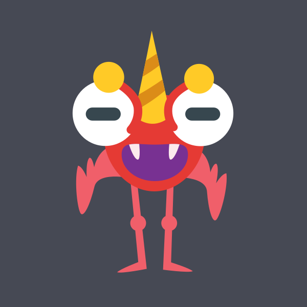
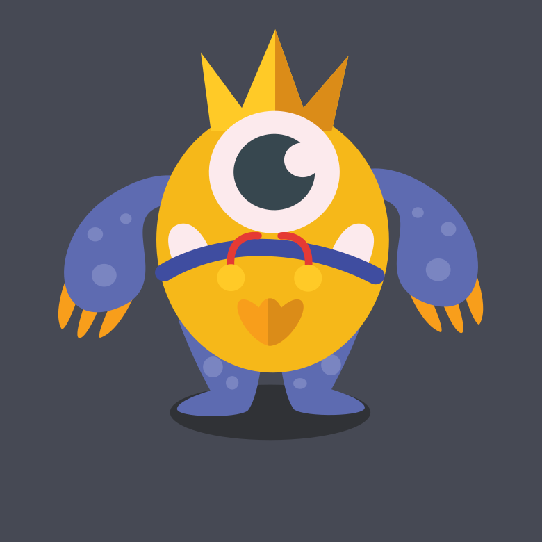
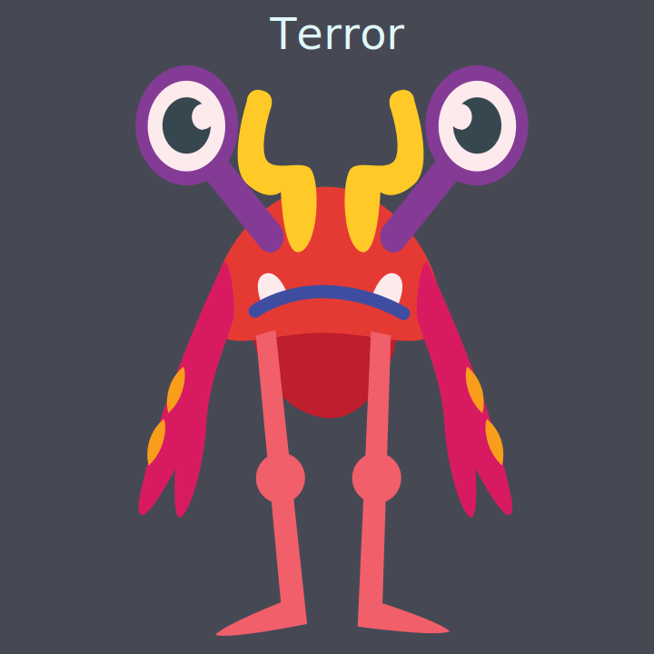
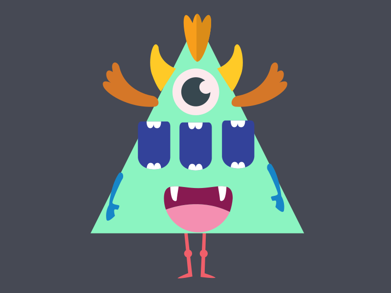
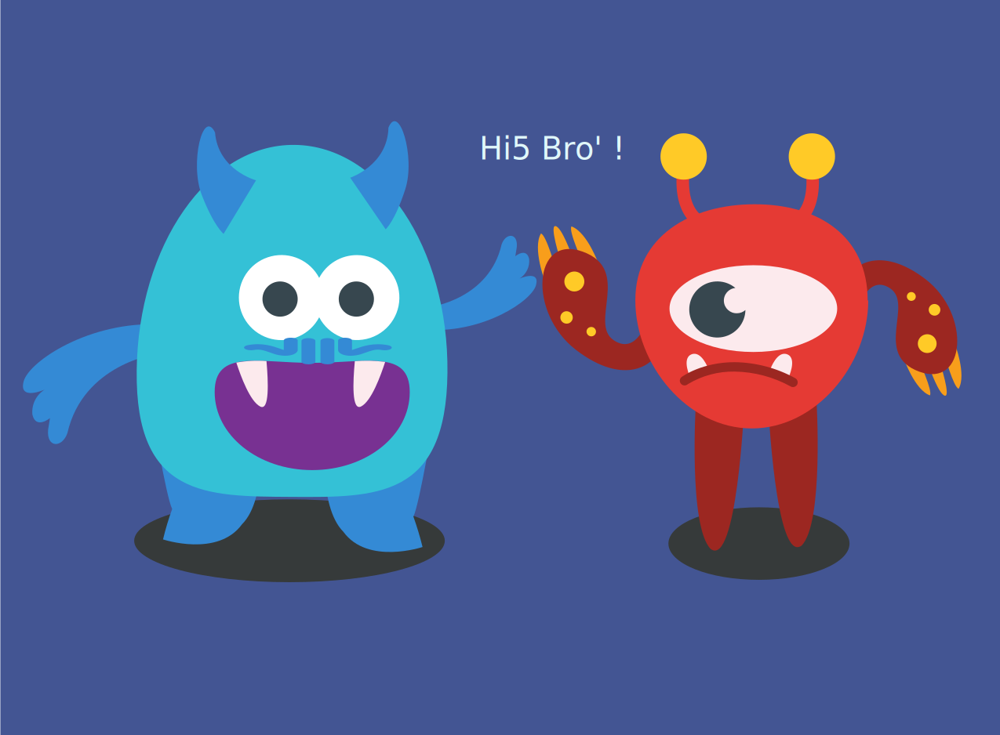
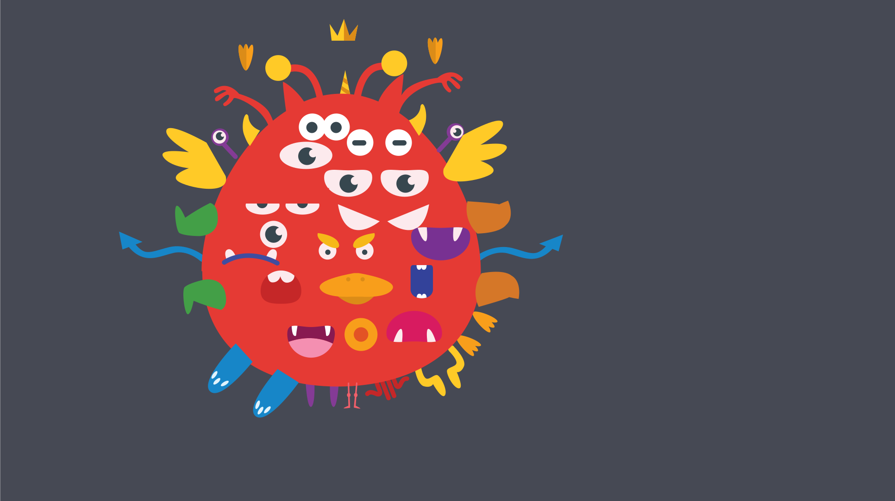
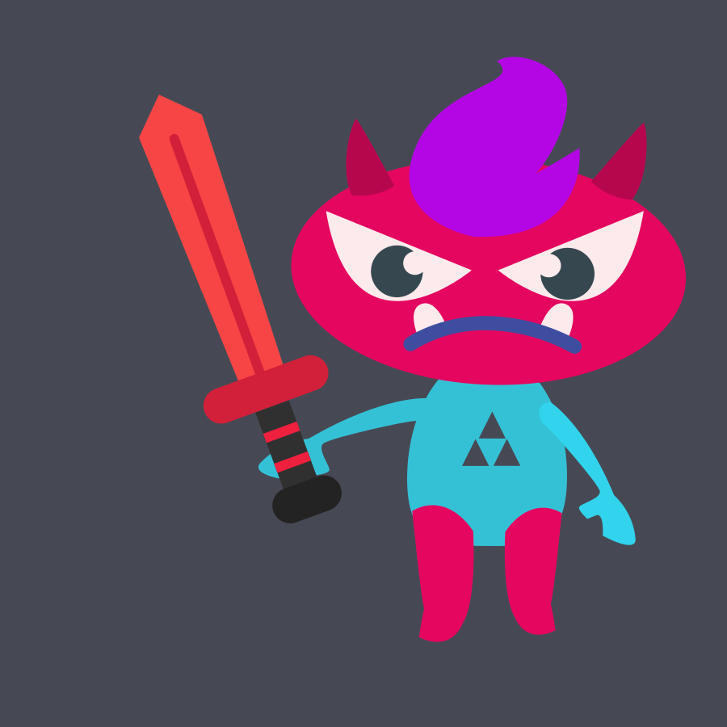
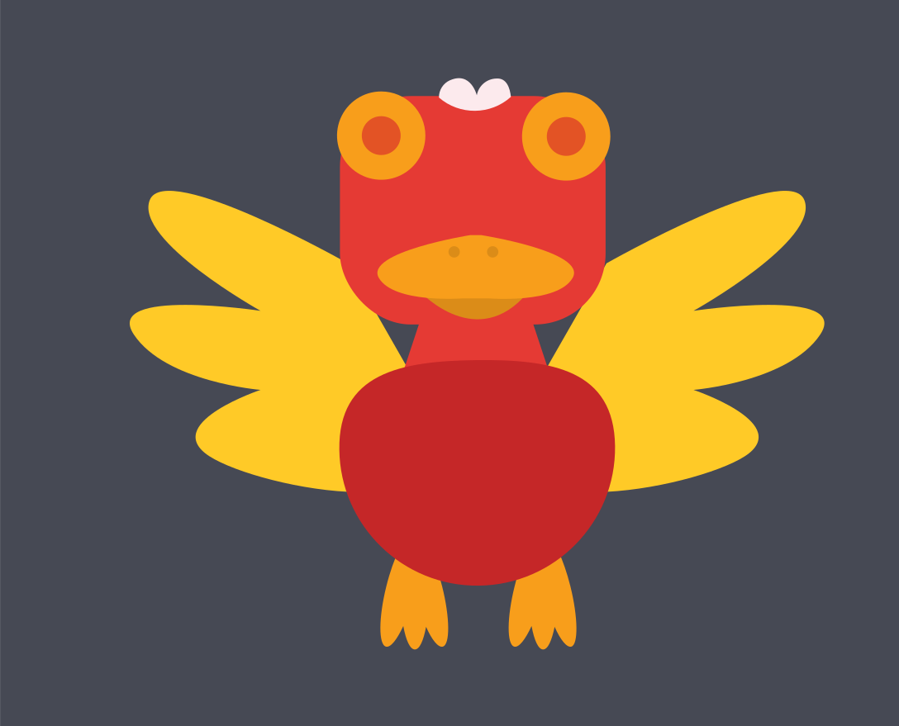
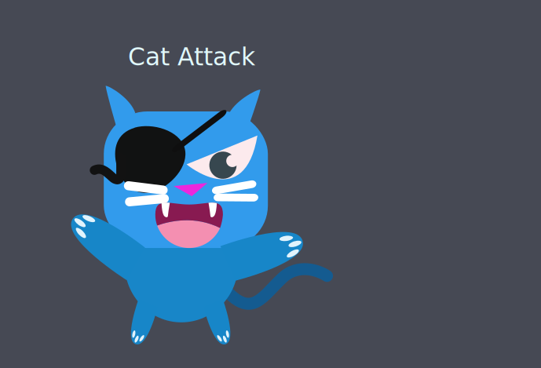

# MONSTERS

A web-app to create monsters with svg.

Made with [Fabric.js](http://fabricjs.com) and React

Svg included provided by [freepick](https://it.freepik.com/home).

# Currently deployed on

- netlify
  [https://monster-factory.netlify.app/](https://monster-factory.netlify.app/)

- surge
  [https://monster-factory.surge.sh](https://monster-factory.surge.sh)

# Some monsters created with the app

